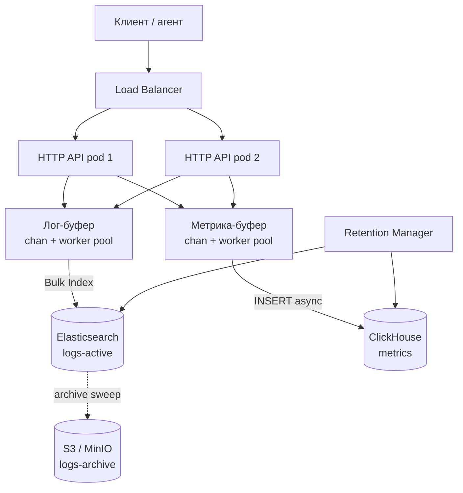
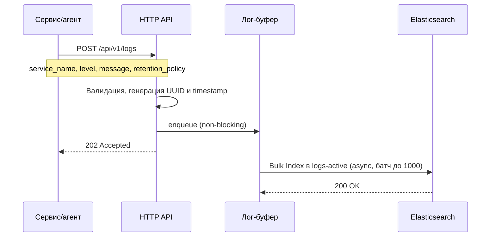
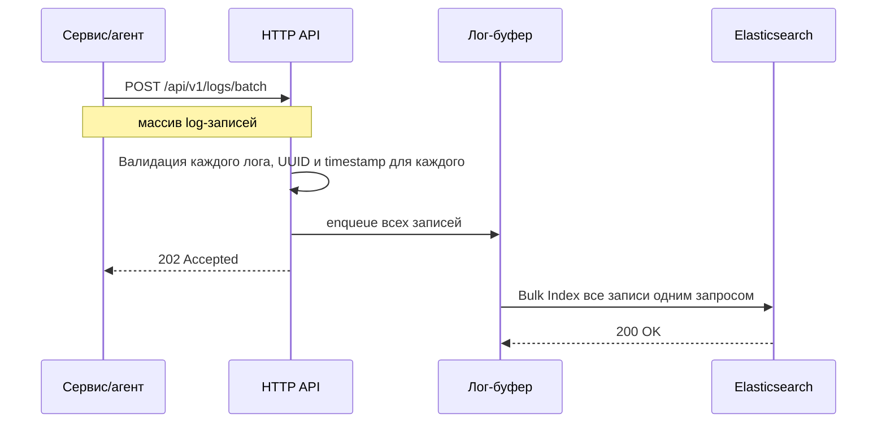
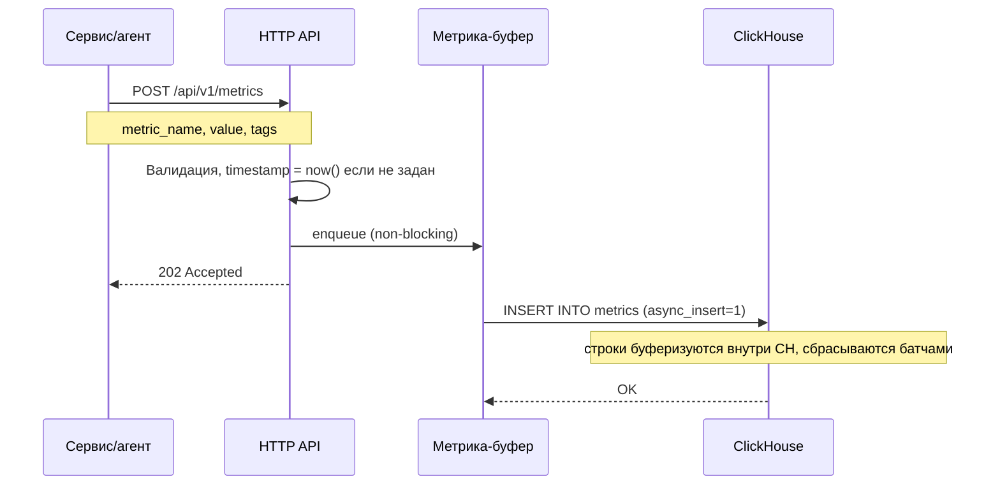
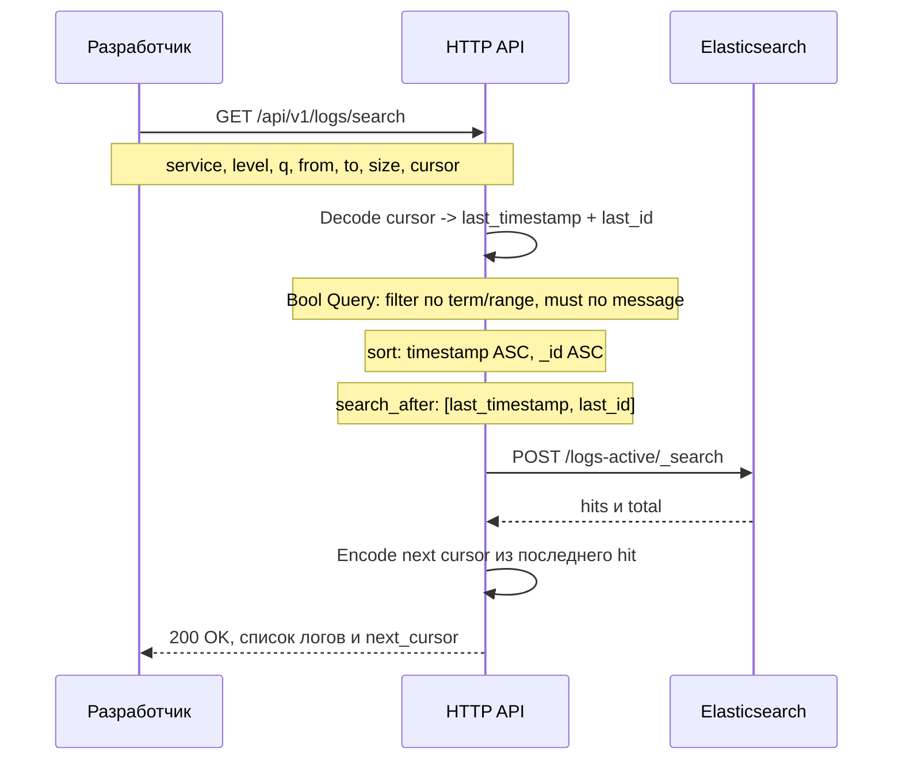
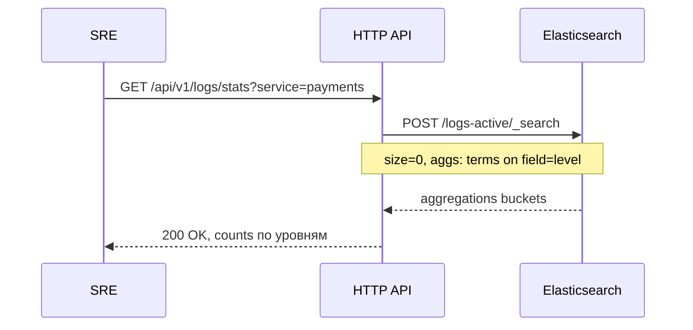
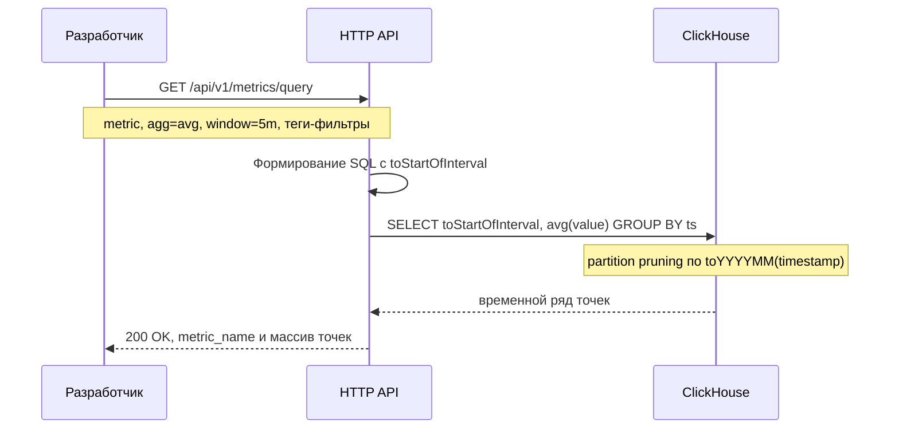
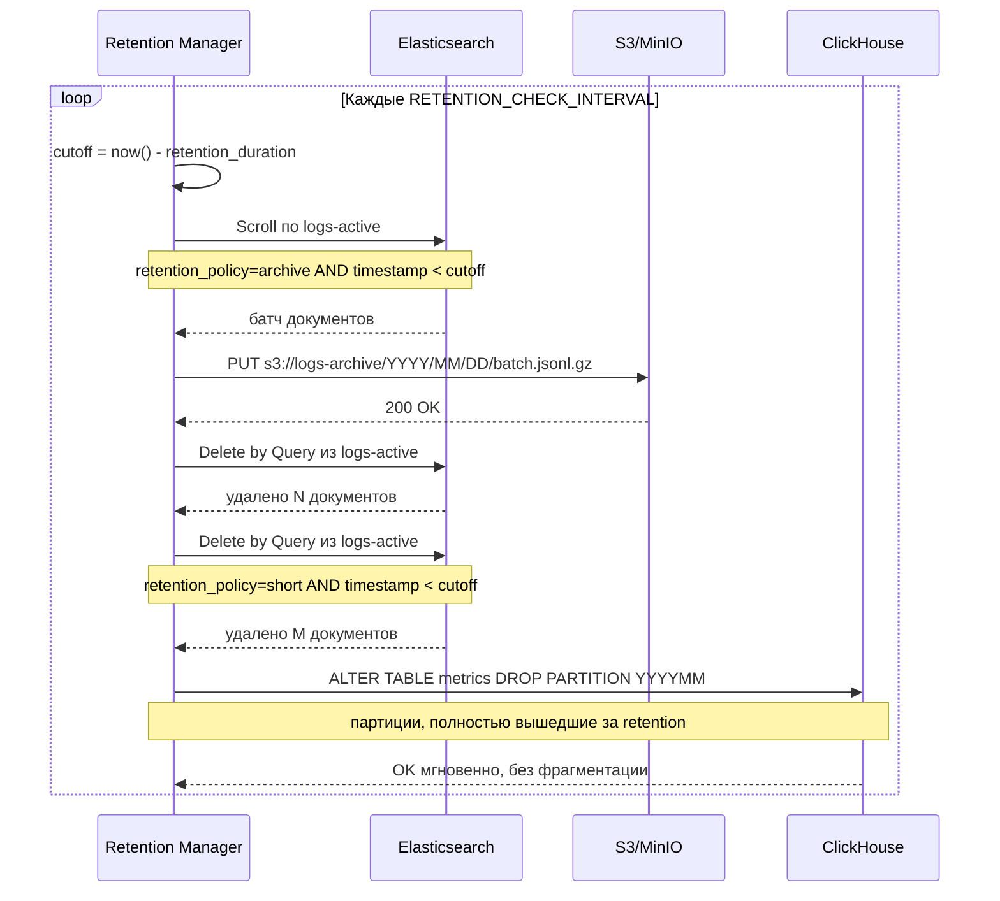

# Техническое решение: Платформа логов и метрик

---

## Глоссарий

| Термин | Определение |
|---|---|
| **Лог** | Структурированная запись о событии в работе сервиса |
| **Метрика** | Числовое измерение состояния системы, привязанное к временной метке |
| **Retention policy** | Политика жизненного цикла лога: `archive` — перенести в холодное хранилище, `short` — удалить по истечении срока |
| **Hot-хранилище** | Быстрое хранилище для актуальных данных с поддержкой full-text поиска (Elasticsearch) |
| **Cold-хранилище** | Дешёвое объектное хранилище для архивных данных без индекса (S3 / MinIO) |
| **Временной ряд** | Последовательность числовых измерений одной метрики в порядке времени |
| **Cursor-пагинация** | Метод пагинации по непрозрачному токену (курсору), не требующий сканирования offset |
| **Ingestion** | Приём данных от клиентов и их запись в хранилище |
| **Retention sweep** | Фоновая операция применения политики хранения |
| **Worker pool** | Пул горутин, асинхронно вычитывающих из канала и пишущих в хранилище батчами |

---

## Функциональные требования

| # | Требование |
|---|---|
| ФТ-1 | Приём одиночных и пакетных лог-записей |
| ФТ-2 | Приём одиночных и пакетных метрик |
| ФТ-3 | Полнотекстовый поиск логов с фильтрами по сервису, хосту, уровню, временному диапазону |
| ФТ-4 | Статистика по уровням логов в разрезе сервиса |
| ФТ-5 | Запрос временного ряда метрики с агрегацией по окну (min / max / avg / sum) |
| ФТ-6 | Управление жизненным циклом логов: политики `archive` и `short` |
| ФТ-7 | Автоматическое удаление метрик по истечении retention |
| ФТ-8 | Поиск по архивным логам (отдельный эндпоинт, расширенный SLA) |

---

## Нефункциональные требования и расчёт нагрузки

### Целевые показатели

| Параметр | Значение |
|---|---|
| Запись логов | 500 000 / сек |
| Запись метрик | 1 000 000 / сек |
| Чтение | 20 000 запросов / сек |
| P95 записи | ≤ 200 мс |
| P95 поиска логов | ≤ 2 с |
| P95 запроса метрик | ≤ 500 мс |
| Доступность | 99.9% |

### Расчёт нагрузки на запись логов (500 000/с)

Средний размер одного лога:

| Поле | Байт |
|---|---|
| service_name, host_id, instance_id | 55 |
| level, retention_policy | 14 |
| message (среднее) | 200 |
| timestamp, id | 68 |
| **Итого** | **~337 → округляем до 400 Б** |

**Пропускная способность:**
- Входящий поток: `500 000 × 400 Б = 200 МБ/с`
- С учётом инвертированного индекса ES (~2×): `~400 МБ/с` записи на диск

**Клиентские запросы к API (batch_size = 100):**
- `500 000 / 100 = 5 000 HTTP-запросов/с`
- Go-инстанс обрабатывает 50 000+ req/s → достаточно **2–3 реплик API**

**Кластер Elasticsearch:**
- Одна шарда на NVMe-диске индексирует ~30 000–50 000 docs/s
- Для 500 000 docs/s необходимо **10–17 первичных шардов**
- Рекомендуемая конфигурация: **6 data-нод, по 2–3 primary shard на ноду**, replication factor = 1

**Хранилище (hot, 30 дней):**
```
500 000 docs/s × 86 400 с × 400 Б × 2 (replica) / 3 (сжатие) ≈ 11.5 ТБ/сутки → 345 ТБ/месяц
```

### Расчёт нагрузки на запись метрик (1 000 000/с)

Средний размер одной метрики:

| Поле | Байт |
|---|---|
| metric_name (LowCardinality) | 20 |
| timestamp | 8 |
| value | 8 |
| tags (Map) | 60 |
| **Итого** | **~96 → округляем до 100 Б** |

**Пропускная способность:** `1 000 000 × 100 Б = 100 МБ/с`

**ClickHouse с async_insert:**
- Буферизует 10 000–100 000 строк и сбрасывает пачками → 10–100 flush/с
- Задокументированный throughput одной ноды: 500 М+ строк/с
- 1 000 000 строк/с — менее 0.2% мощности одной ноды → **запас на 500×**

**Worker pool в API:**
- 10 горутин × 100 000 rows/s каждая = 1 000 000 rows/s ✓

**Хранилище (7 дней, сжатие ×5):**
```
1 000 000 rows/s × 86 400 с × 100 Б / 5 ≈ 1.7 ТБ/сутки → 12 ТБ/неделю
```

### Расчёт нагрузки на чтение (20 000/с)

- ES-поиск: ~2 000 запросов/с (сложные) — покрывается кластером из 6 нод с field data cache
- ClickHouse-запросы: ~18 000/с (агрегации) — ClickHouse обрабатывает тысячи конкурентных запросов
- API-уровень: 20 000 req/s → **3–4 реплики API** (с учётом записи)

---

## 1. Краткое описание системы и её назначения

Платформа предназначена для централизованного сбора, хранения и анализа телеметрии распределённых сервисов. Принимает два типа данных:

- **Логи** — текстовые записи о событиях в работе приложений и инфраструктуры.
- **Метрики** — числовые измерения состояния системы, привязанные ко времени.

Целевая аудитория — разработчики и SRE-команды, которым необходимо отлаживать инциденты, мониторить состояние сервисов и анализировать поведение системы во времени.

**Технологический стек:** Go (HTTP API) · Elasticsearch (горячее хранилище логов) · ClickHouse (хранилище метрик) · S3 / MinIO (холодный архив логов)

---

## 3. Модель логов и метрик

### Лог-запись

```
Log {
    id               string          // UUID v4, генерируется платформой
    timestamp        time (RFC3339)  // время события
    service_name     string          // обязательное
    host_id          string          // обязательное
    instance_id      string          // опциональное (pod, container)
    level            enum            // DEBUG | INFO | WARNING | ERROR | FATAL
    message          string          // текст события, индексируется full-text
    retention_policy enum            // archive | short
}
```

### Метрика

```
Metric {
    metric_name  string              // например: cpu.usage, http.rps
    timestamp    time (RFC3339)      // время измерения
    value        float64             // числовое значение
    tags         map[string]string   // {"service": "...", "host": "...", "region": "..."}
}
```

### Обоснование модели

- `retention_policy` задаётся на уровне каждого события, а не конфигурации сервиса — разные события одного сервиса могут иметь разный жизненный цикл (транзакционные ошибки нужно хранить дольше, чем отладочные трейсы).
- `tags` в метриках — `Map(String, String)` без фиксированной схемы — произвольные измерения добавляются без DDL-миграций.
- Метрика хранит одно числовое поле `value` (`Float64`); для нескольких метрик одновременно клиент использует batch-эндпоинт.

---

## 4. Архитектура приёма, буферизации, обработки и хранения данных

### Диаграмма компонентов



### Приём и платформенная буферизация

HTTP-хендлер принимает запрос, валидирует и немедленно помещает данные во **внутренний буфер** (buffered Go channel). Ответ `202 Accepted` возвращается клиенту до завершения записи в хранилище. Клиент **не несёт ответственности** за повторные попытки при отказе хранилища.

```
HTTP-хендлер
     │ enqueue (non-blocking)
     ▼
chan logs    (ёмкость: 1 000 000) ──► worker pool (16 горутин) ──► Elasticsearch
chan metrics (ёмкость: 5 000 000) ──► worker pool (8 горутин)  ──► ClickHouse
     │
     └── channel full → 503 Overloaded (backpressure)
```

**Логика воркеров:**
1. Накапливают записи из канала в батч (до 1 000 записей или 100 мс — что наступит раньше).
2. Отправляют батч в хранилище.
3. При ошибке — повтор с экспоненциальной задержкой (1 с → 2 с → 4 с, максимум 3 попытки).
4. После трёх неудачных попыток: метрики и `short`-логи отбрасываются (допустимые потери); `archive`-логи записываются во временный WAL-файл на локальном диске и повторяются при восстановлении хранилища.

### Буферизация на уровне хранилищ

- **Elasticsearch** — запись с `refresh=false`: документы попадают в буферный сегмент, индекс обновляется асинхронно каждые ~1 сек.
- **ClickHouse** — `async_insert=1, wait_for_async_insert=0`: строки копятся во внутреннем буфере CH и сбрасываются на диск пачками, что даёт throughput на порядок выше синхронной вставки.

---

## 2. Основные пользовательские и технические сценарии

### Пользовательские сценарии

| Актор | Сценарий |
|---|---|
| Сервис / агент | Отправляет лог-записи в платформу (одиночно или пакетно) |
| Сервис / агент | Отправляет числовые метрики с временной меткой и тегами |
| Разработчик | Ищет логи за период по сервису, уровню, ключевому слову в тексте |
| Разработчик | Просматривает временной ряд метрики (CPU, RPS) с агрегацией по окну |
| SRE | Запрашивает статистику: сколько ERROR-логов за час по сервису |
| SRE | Ищет конкретное событие в архивных логах |
| Платформа | Автоматически архивирует в S3 или удаляет устаревшие данные |

### Технические сценарии

#### Запись лога

Клиент отправляет одиночный лог. Сервис валидирует поля, генерирует UUID и timestamp, кладёт запись в канал и сразу отвечает клиенту. Воркер фоново отправляет батч в Elasticsearch.



#### Пакетная запись логов

Аналогично одиночной, но весь батч помещается в канал единой операцией, что снижает per-record overhead.



#### Запись метрики

Метрика помещается в отдельный канал. Воркер накапливает строки и вставляет в ClickHouse, используя `async_insert`, который дополнительно буферизует данные внутри CH.



#### Поиск логов (cursor-пагинация)

Клиент передаёт фильтры и опциональный курсор для следующей страницы. Сервис строит Bool Query с `search_after` вместо `from/offset`, что исключает деградацию на глубоких страницах.



#### Статистика по уровням

Агрегационный запрос без возврата документов. Возвращает количество логов по каждому уровню за указанный период.



#### Запрос временного ряда метрик

Сервис строит SQL с `toStartOfInterval` и агрегационной функцией. ClickHouse читает только нужные партиции благодаря partition pruning.



#### Фоновый sweep Retention Manager

Retention Manager работает как отдельная горутина с периодическим таймером. Для логов с политикой `archive` — выгружает в S3 и удаляет из ES. Для `short` — удаляет из ES. Для метрик — сбрасывает целые партиции ClickHouse.



---

## 5. Подход к индексированию и поиску по логам

### Хранилище

Elasticsearch с одним горячим индексом `logs-active`. Архивные данные переносятся в S3 (см. раздел 7).

### Маппинг индекса

```json
{
  "settings": {
    "number_of_shards": 12,
    "number_of_replicas": 1,
    "refresh_interval": "1s"
  },
  "mappings": {
    "properties": {
      "timestamp":        { "type": "date" },
      "service_name":     { "type": "keyword" },
      "host_id":          { "type": "keyword" },
      "level":            { "type": "keyword" },
      "message":          { "type": "text", "analyzer": "standard" },
      "retention_policy": { "type": "keyword" }
    }
  }
}
```

- Поля-фильтры (`service_name`, `level`, `retention_policy`) — тип `keyword`: точное совпадение, не токенизируются, кэшируются в filter context.
- Поле `message` — тип `text` со стандартным анализатором: токенизация, lower-case, full-text поиск через `match`.

### Поисковый запрос

```json
{
  "query": {
    "bool": {
      "filter": [
        { "range": { "timestamp": { "gte": "2024-01-01T00:00:00Z", "lte": "2024-01-02T00:00:00Z" } } },
        { "term":  { "service_name": "payments" } },
        { "term":  { "level": "ERROR" } }
      ],
      "must": [
        { "match": { "message": "connection refused" } }
      ]
    }
  },
  "sort": [
    { "timestamp": { "order": "asc" } },
    { "_id":       { "order": "asc" } }
  ],
  "search_after": ["2024-01-01T10:05:00Z", "abc123"],
  "size": 100
}
```

`filter` используется для структурированных полей — не влияет на score и кэшируется. `must` — только для full-text, так как участвует в ранжировании.

### Cursor-пагинация (search_after)

Offset-пагинация (`from: N`) требует сканирования N документов на каждый запрос — при глубоких страницах это O(N) по всем шардам. `search_after` продолжает поиск от последнего известного документа:

| Подход | Глубокая страница | Стабильность при вставке |
|---|---|---|
| offset / page | O(offset) — деградирует | нестабильна (новые docs сдвигают страницы) |
| `search_after` | O(1) — константно | стабильна при сортировке по timestamp + _id |

**Протокол:** первая страница запрашивается без курсора. Ответ содержит `next_cursor: base64(last_timestamp + last_id)`. Следующая страница передаёт `?cursor=<token>`.

---

## 6. Подход к хранению и чтению метрик как временных рядов

### Схема таблицы

```sql
CREATE TABLE metrics
(
    metric_name  LowCardinality(String),
    timestamp    DateTime64(3, 'UTC'),
    value        Float64,
    tags         Map(String, String)
)
ENGINE = MergeTree()
PARTITION BY toYYYYMM(timestamp)
ORDER BY (metric_name, timestamp)
SETTINGS index_granularity = 8192;
```

- `LowCardinality(String)` для `metric_name` — словарное кодирование: имена метрик повторяются миллиарды раз, экономия памяти и CPU.
- `PARTITION BY toYYYYMM(timestamp)` — ежемесячные партиции: запросы по диапазону дат читают только нужные партиции (partition pruning); удаление — мгновенный `DROP PARTITION` без фрагментации.
- `ORDER BY (metric_name, timestamp)` — первичный индекс; запросы по конкретной метрике за период пропускают нерелевантные гранулы.

### Чтение временного ряда

**Сырые данные:**
```sql
SELECT timestamp, value
FROM metrics
WHERE metric_name = 'cpu.usage'
  AND timestamp >= '2024-01-01 00:00:00'
  AND timestamp <  '2024-01-02 00:00:00'
  AND tags['service'] = 'payments'
ORDER BY timestamp ASC
```

**С агрегацией по окну:**
```sql
SELECT
    toStartOfInterval(timestamp, INTERVAL 300 SECOND) AS ts,
    avg(value) AS value
FROM metrics
WHERE metric_name = 'cpu.usage'
  AND tags['service'] = 'payments'
  AND timestamp >= '2024-01-01 00:00:00'
  AND timestamp <  '2024-01-02 00:00:00'
GROUP BY ts
ORDER BY ts ASC
```

Поддерживаемые агрегаты: `min`, `max`, `avg`, `sum`. Размер окна принимается как строка (`1m`, `5m`, `1h`) и конвертируется в секунды при построении запроса.

---

## 7. Подход к политике хранения логов (archive / short)

### Политики

| Политика | Поведение после истечения `LOGS_RETENTION_DURATION` |
|---|---|
| `archive` | Данные выгружаются в S3/MinIO в сжатом виде, затем удаляются из Elasticsearch |
| `short` | Данные удаляются из Elasticsearch без переноса |

### Архивное хранилище: S3 / MinIO

Elasticsearch — дорогое горячее хранилище с инвертированным индексом. Архивные логи, которые редко просматриваются, переносятся в объектное хранилище:

- **Стоимость:** S3-совместимое хранилище стоит в 10–50× дешевле блочного/SSD-хранилища для ES.
- **Формат:** Newline-delimited JSON, сжатый gzip (~4–6× компрессия).
- **Путь:** `s3://logs-archive/{YYYY}/{MM}/{DD}/{service_name}/{batch_id}.jsonl.gz`
- **Поиск по архиву:** отдельный эндпоинт `GET /api/v1/logs/archive/search` с расширенным SLA (до 30 с). Retention Manager сканирует нужные S3-объекты по пути (дата + сервис) и фильтрует записи в памяти. Для полноценного SQL-поиска по архиву — Amazon Athena / Trino поверх Parquet-файлов.

### Реализация sweep

```
Каждый RETENTION_CHECK_INTERVAL:

cutoff = now() - LOGS_RETENTION_DURATION

1. Archive sweep:
   ES Scroll (retention_policy=archive, timestamp < cutoff)
   → для каждого батча: PUT s3://logs-archive/.../batch.jsonl.gz
   → Delete by Query из logs-active

2. Short sweep:
   Delete by Query из logs-active
   (retention_policy=short, timestamp < cutoff)
```

Sweep идемпотентен: если объект уже существует в S3 — PUT перезаписывает. Повторный запуск не приводит к дублированию данных.

---

## 8. Подход к удалению метрик по истечении retention

Метрики хранятся в ClickHouse с партиционированием по месяцам (`toYYYYMM`). Удаление реализовано через **`DROP PARTITION`** — атомарная, мгновенная операция без фоновых мутаций и фрагментации.

### Алгоритм

```
cutoff_month = toYYYYMM(now() - METRICS_RETENTION_DURATION)

Для каждой партиции P в metrics:
    если P < cutoff_month:
        ALTER TABLE metrics DROP PARTITION P
```

**Пример** (retention = 30 дней, сегодня 2024-02-15):
- `cutoff` = 2024-01-16
- `cutoff_month` = 202401
- Партиция `202401` ещё частично попадает в retention → **не трогаем**
- Партиция `202312` полностью вышла за retention → **DROP PARTITION '202312'**

Для точного удаления внутри текущей retention-границы (когда retention не кратен целому месяцу) добавляется одна финальная мутация:
```sql
ALTER TABLE metrics DELETE
WHERE toYYYYMM(timestamp) = cutoff_month
  AND timestamp < cutoff
```
Мутация выполняется асинхронно и запускается не чаще 1 раза в сутки.

---

## 9. Подход к масштабированию и обеспечению отказоустойчивости

### Горизонтальное масштабирование

| Компонент | Подход |
|---|---|
| HTTP API | Stateless, N реплик за L7-балансировщиком (nginx, Envoy) |
| Elasticsearch | 6+ data-нод, 12 primary shards, replication factor = 1 |
| ClickHouse | Кластер: шардирование по `cityHash64(metric_name)`, репликация через ClickHouse Keeper |
| Retention Manager | Один активный экземпляр; при N репликах API — leader election через Redis |
| S3 / MinIO | Нативно распределённое хранилище |

### Сценарии отказов

| Сбой | Поведение |
|---|---|
| Один pod API | LB перестаёт направлять трафик; буфер теряется; допустимые потери |
| ES-нода | Replica shard принимает трафик; деградации нет |
| CH-нода | Replica shard принимает трафик; async_insert буфер той ноды теряется (допустимо) |
| ES временно недоступен | Воркеры делают 3 попытки с backoff; `archive`-логи пишутся в WAL |
| S3 временно недоступен | Sweep откладывается до следующего интервала; данные остаются в ES |

### Репликация данных

- **Elasticsearch:** `number_of_replicas = 1` — каждый шард имеет одну реплику на другой ноде.
- **ClickHouse:** `ReplicatedMergeTree` + ClickHouse Keeper — синхронная репликация между репликами шарда.

---

## 10. Подход к работе в режиме допустимых потерь

### Классификация данных по допустимости потерь

| Тип данных | Допустимость | Обоснование |
|---|---|---|
| Метрики | < 0.1% | Потеря нескольких точек не влияет на тренды и алертинг |
| Логи `short` | Допустима | Краткосрочные данные, не критичны для аудита |
| Логи `archive` | Нежелательна | Долгосрочное хранение, используется при разборе инцидентов |

### Механизмы

**Платформенная буферизация (основной механизм):**
- In-memory каналы поглощают кратковременные всплески без отказа клиентам.
- Воркеры повторяют запись с backoff — клиент уже получил `202` и не знает об ошибке.

**Для archive-логов — WAL на локальном диске:**
- Если 3 попытки записи в ES провалились, воркер записывает батч в WAL-файл.
- При восстановлении ES — WAL-компонент реплейит файлы в хранилище.
- Обеспечивает гарантию at-least-once для archive-логов.

**ClickHouse async_insert:**
- `wait_for_async_insert=0` — API не ждёт подтверждения flush.
- Данные в буфере CH теряются при краше CH-процесса — приемлемо для метрик.
- Для повышения надёжности: `wait_for_async_insert=1` (с потерей ~20% throughput).

**Backpressure:**
- Если in-memory канал заполнен (хранилище деградирует длительно), API возвращает `503 Overloaded`.
- Клиент (агент сбора) реализует локальный буфер и exponential backoff — платформа сигнализирует о перегрузке явно, а не теряет данные молча.

---

## 11. Основные компромиссы выбранного решения

| Решение | Плюс | Минус |
|---|---|---|
| Платформенный буфер вместо Kafka | Нет дополнительной инфраструктуры, низкая latency | Буфер теряется при краше процесса; нет персистентной очереди |
| Elasticsearch для горячих логов | Мощный full-text поиск, rich query DSL | Высокое потребление RAM/CPU; дорог для архивных данных |
| S3/MinIO для архива | В 10–50× дешевле ES; неограниченный объём | Полнотекстовый поиск по архиву требует сканирования объектов |
| ClickHouse для метрик | Экстремальный throughput, эффективные агрегации, SQL | Map(String,String) без отдельных индексов на ключи — фильтр по тегу медленнее |
| PARTITION BY toYYYYMM | DROP PARTITION — мгновенно и без фрагментации | Retention кратен месяцу; для точного cutoff нужна дополнительная мутация |
| cursor-пагинация (search_after) | O(1) на любой глубине; стабильна при вставке | Нельзя перейти на произвольную страницу; курсор одноразовый |
| async_insert в ClickHouse | Throughput 10–50× выше синхронной вставки | Потеря данных в буфере CH при жёстком краше |
| Два отдельных хранилища | Каждое оптимизировано под свою задачу | Больше компонентов; операционная сложность выше |

---

## Запуск

```bash
GOPROXY=https://goproxy.cn go mod tidy
GOOS=linux GOARCH=arm64 go build -o telemetry-platform ./cmd/server
docker-compose build app && docker-compose up
curl http://localhost:8080/health
```

## Тестирование

```bash
# Записать лог
curl -s -X POST http://localhost:8080/api/v1/logs \
  -H "Content-Type: application/json" \
  -d '{"service_name":"payments","host_id":"host-1","level":"ERROR","message":"db timeout","retention_policy":"archive"}' | jq

# Поиск с пагинацией
curl -s "http://localhost:8080/api/v1/logs/search?level=ERROR&service=payments&size=20" | jq

# Следующая страница по курсору
curl -s "http://localhost:8080/api/v1/logs/search?level=ERROR&size=20&cursor=<next_cursor>" | jq

# Статистика
curl -s "http://localhost:8080/api/v1/logs/stats?service=payments" | jq

# Записать метрику
curl -s -X POST http://localhost:8080/api/v1/metrics \
  -H "Content-Type: application/json" \
  -d '{"metric_name":"cpu.usage","value":87.5,"tags":{"service":"payments","host":"host-1"}}' | jq

# Временной ряд с агрегацией
curl -s "http://localhost:8080/api/v1/metrics/query?metric=cpu.usage&service=payments&agg=avg&window=5m" | jq
```
