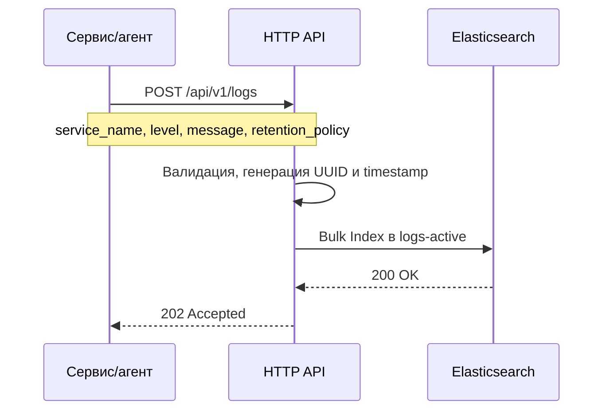
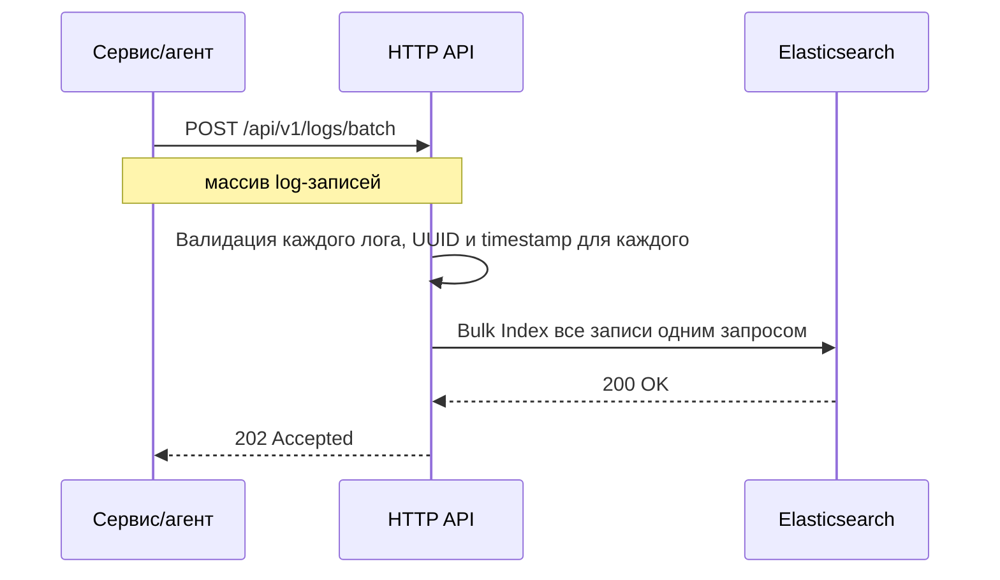
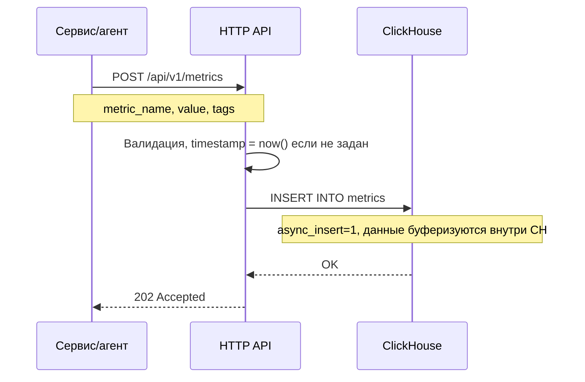
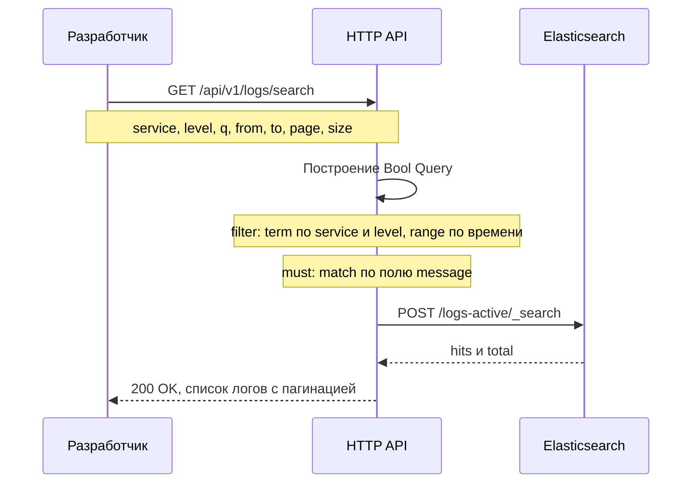
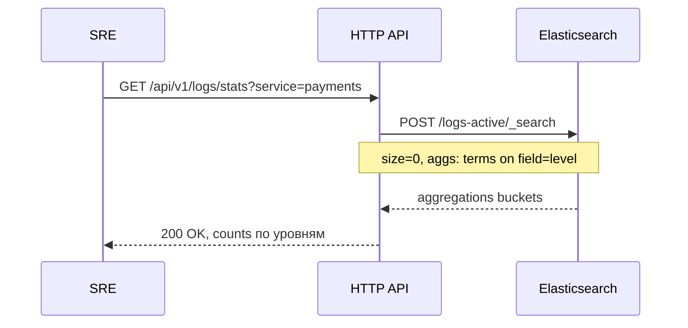
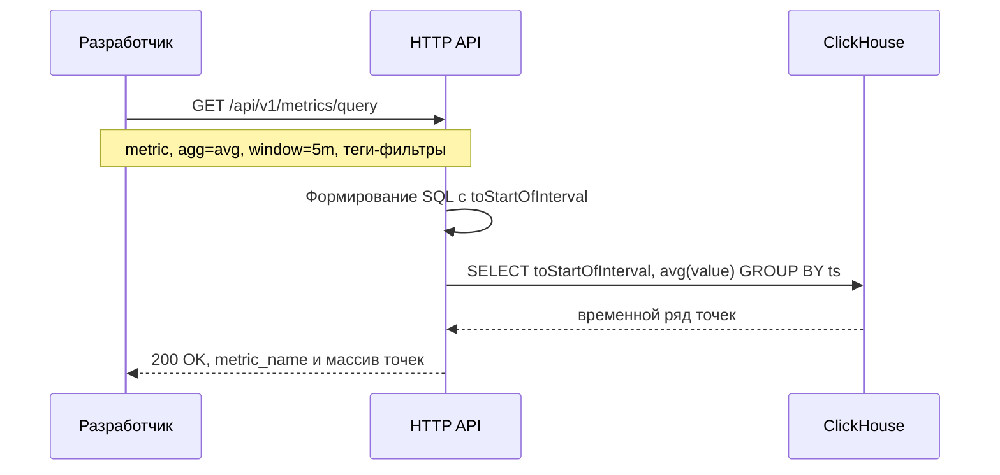
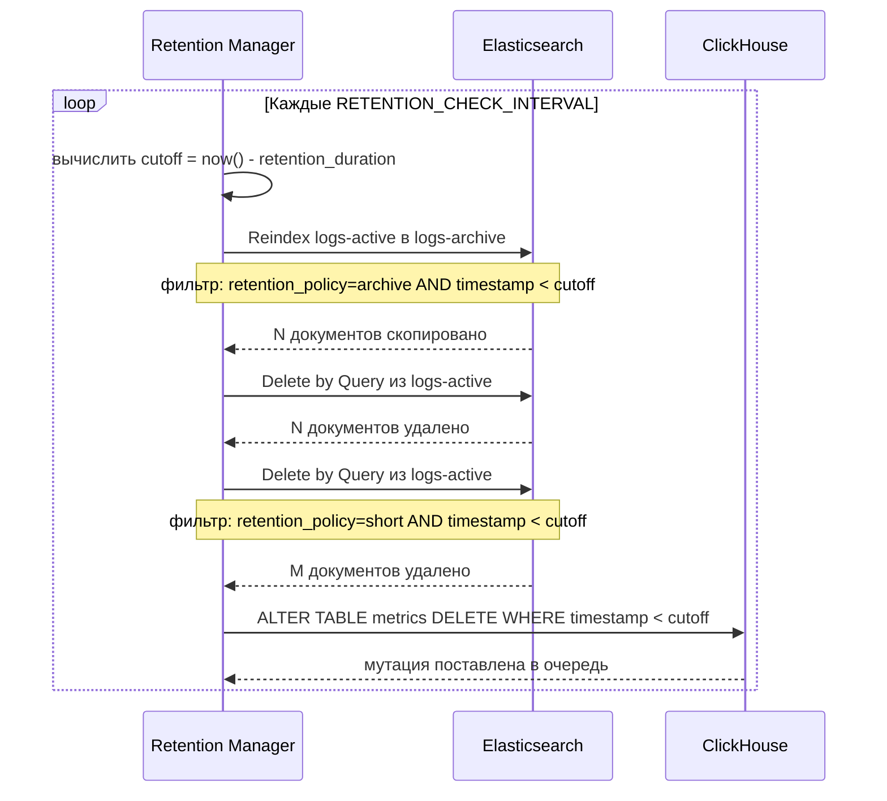

# Техническое решение: Платформа логов и метрик

## 1. Краткое описание системы и её назначения

Платформа предназначена для централизованного сбора, хранения и анализа телеметрии распределённых сервисов. Система принимает два типа данных:

- **Логи** — текстовые записи о событиях в работе приложений и инфраструктуры.
- **Метрики** — числовые измерения состояния системы, привязанные ко времени.

Целевая аудитория — разработчики и SRE-команды, которым необходимо отлаживать инциденты, мониторить состояние сервисов и анализировать поведение системы во времени.

**Технологический стек:** Go (HTTP API) · Elasticsearch (хранилище логов) · ClickHouse (хранилище метрик)

---

## 2. Основные пользовательские и технические сценарии

### Пользовательские сценарии

| Актор | Сценарий |
|---|---|
| Сервис / агент | Отправляет лог-записи в платформу (одиночно или пакетно) |
| Сервис / агент | Отправляет числовые метрики с временной меткой и тегами |
| Разработчик | Ищет логи за период по сервису, уровню, ключевому слову в тексте |
| Разработчик | Просматривает временной ряд метрики (CPU, RPS) с агрегацией по окну |
| SRE | Запрашивает статистику — сколько ERROR-логов за час по сервису |
| Платформа | Автоматически архивирует или удаляет устаревшие данные |

### Технические сценарии

#### Запись лога



#### Пакетная запись логов



#### Запись метрики



#### Поиск логов



#### Статистика по уровням



#### Запрос временного ряда метрик



#### Фоновый sweep Retention Manager



---

## 3. Модель логов и метрик

### Лог-запись

```
Log {
    id               string          // UUID, генерируется платформой
    timestamp        time (RFC3339)  // время события
    service_name     string          // обязательное
    host_id          string          // обязательное
    instance_id      string          // опциональное (pod, container)
    level            enum            // DEBUG | INFO | WARNING | ERROR | FATAL
    message          string          // текст события (индексируется full-text)
    retention_policy enum            // archive | short
}
```

### Метрика

```
Metric {
    metric_name  string              // "cpu.usage", "http.rps"
    timestamp    time (RFC3339)      // время измерения
    value        float64             // числовое значение
    tags         map[string]string   // {"service": "...", "host": "...", "region": "..."}
}
```

### Почему такая модель

- `retention_policy` вынесен в лог, а не в конфигурацию — разные события одного сервиса могут иметь разный жизненный цикл.
- `tags` в метриках — `Map(String, String)` без схемы, что позволяет добавлять произвольные измерения без миграций.
- Метрика всегда содержит одно поле `value` — в ClickHouse это `Float64`. Для множества одновременных метрик клиент отправляет пакет.

---

## 4. Архитектура приёма, обработки и хранения данных

### Схема потока данных

```
Сервис / агент
      │
      ▼
┌─────────────────┐
│   HTTP API      │
│  (validation)   │
└────────┬────────┘
         │
    ┌────┴────┐
    ▼         ▼
┌───────┐  ┌──────────┐
│  ES   │  │ClickHouse│
│(логи) │  │(метрики) │
└───────┘  └──────────┘
         │
         ▼
  Retention Manager
  (асинхронная, фоновая sweep)
```

### Приём (Ingestion)

HTTP API принимает запросы на запись и сразу пишет в хранилище синхронно. Это упрощает архитектуру и снижает операционную сложность.

### Буферизация

Буферизация реализована на уровне хранилищ:

- **Elasticsearch** — запись с `refresh=false`: документы попадают в буферный сегмент, индекс обновляется асинхронно каждые ~1 сек. Это позволяет не блокироваться на синхронном flush при каждой записи.
- **ClickHouse** — включён `async_insert=1, wait_for_async_insert=0`: данные сначала попадают во внутренний буфер ClickHouse и пишутся на диск батчами. Это увеличивает throughput на 10–50x по сравнению с синхронной вставкой.

При необходимости горизонтального масштабирования записи между HTTP-уровнем и хранилищами добавляется Apache Kafka (топики `logs` и `metrics`), которая берёт на себя выравнивание пиков нагрузки.

### Пакетные эндпоинты

Для снижения overhead предусмотрены:
- `POST /api/v1/logs/batch` — bulk-индексация в Elasticsearch через Bulk API.
- `POST /api/v1/metrics/batch` — батчевая вставка через `PrepareBatch` в ClickHouse.

---

## 5. Подход к индексированию и поиску по логам

### Хранилище

Elasticsearchс двумя индексами:

| Индекс | Назначение |
|---|---|
| `logs-active` | горячие данные, основной поиск |
| `logs-archive` | архивные данные (политика `archive` после retention) |

### Маппинг

```json
{
  "mappings": {
    "properties": {
      "timestamp":        { "type": "date" },
      "service_name":     { "type": "keyword" },
      "host_id":          { "type": "keyword" },
      "level":            { "type": "keyword" },
      "message":          { "type": "text", "analyzer": "standard" },
      "retention_policy": { "type": "keyword" }
    }
  }
}
```

- Поля-фильтры (`service_name`, `level`, `retention_policy`) — тип `keyword`: точное совпадение, не токенизируются, эффективны для `term`-фильтров.
- Поле `message` — тип `text` со стандартным анализатором: токенизация, стемминг, поддержка full-text поиска через `match`.

### Поисковый запрос

Строится как Elasticsearch Bool Query:

```json
{
  "query": {
    "bool": {
      "filter": [
        { "range": { "timestamp": { "gte": "...", "lte": "..." } } },
        { "term": { "service_name": "payments" } },
        { "term": { "level": "ERROR" } }
      ],
      "must": [
        { "match": { "message": "connection refused" } }
      ]
    }
  },
  "sort": [{ "timestamp": { "order": "asc" } }],
  "from": 0,
  "size": 100
}
```

`filter` используется для структурированных полей — он не влияет на релевантность и кэшируется. `must` используется только для full-text, так как влияет на score.

### Агрегация по уровням

```json
{
  "size": 0,
  "aggs": {
    "by_level": { "terms": { "field": "level" } }
  }
}
```

---

## 6. Подход к хранению и чтению метрик как временных рядов

### Хранилище

ClickHouse — колоночная аналитическая БД, оптимизированная для временных рядов и агрегаций.

### Схема таблицы

```sql
CREATE TABLE metrics (
    metric_name  LowCardinality(String),   -- экономия памяти на повторяющихся именах
    timestamp    DateTime64(3, 'UTC'),
    value        Float64,
    tags         Map(String, String)        -- произвольные теги без схемы
)
ENGINE = MergeTree()
PARTITION BY toYYYYMM(timestamp)            -- партиции по месяцам
ORDER BY (metric_name, timestamp)           -- первичный индекс — имя + время
SETTINGS index_granularity = 8192
```

**Почему MergeTree + партиционирование по месяцу:**
- Запросы по временному диапазону читают только нужные партиции (partition pruning).
- Удаление устаревших данных — `DROP PARTITION` для старых месяцев: мгновенно и без фрагментации.

### Чтение временного ряда

**Сырые данные (без агрегации):**
```sql
SELECT timestamp AS ts, value
FROM metrics
WHERE metric_name = 'cpu.usage'
  AND timestamp >= ? AND timestamp <= ?
  AND tags['service'] = 'payments'
ORDER BY ts ASC
```

**С агрегацией по окну:**
```sql
SELECT
    toStartOfInterval(timestamp, INTERVAL 300 SECOND) AS ts,
    avg(value) AS value
FROM metrics
WHERE metric_name = 'cpu.usage'
  AND tags['service'] = 'payments'
GROUP BY ts
ORDER BY ts ASC
```

Поддерживаемые агрегаты: `min`, `max`, `avg`, `sum`.

---

## 7. Подход к политике хранения логов (archive / short)

Каждый лог при записи помечается полем `retention_policy`:

| Политика | Поведение по истечении retention |
|---|---|
| `archive` | Лог копируется в индекс `logs-archive`, затем удаляется из `logs-active` |
| `short` | Лог удаляется из `logs-active` без архивирования |

### Реализация

Фоновый **Retention Manager** запускается как горутина при старте сервиса и выполняет sweep с интервалом `RETENTION_CHECK_INTERVAL` (дефолт 1 час). При каждом запуске:

1. Вычисляется `cutoff = now() - LOGS_RETENTION_DURATION`.
2. **Archive sweep** — Elasticsearch Reindex API: копирует документы с `retention_policy=archive AND timestamp < cutoff` из `logs-active` в `logs-archive`.
3. После успешного reindex — Delete by Query: удаляет скопированные документы из `logs-active`.
4. **Short sweep** — Delete by Query: удаляет документы с `retention_policy=short AND timestamp < cutoff` из `logs-active`.

```
logs-active
    │
    ├── archive + старше cutoff  ──reindex──►  logs-archive
    │                            ──delete──►  (удалено из active)
    │
    └── short + старше cutoff   ──delete──►  (удалено навсегда)
```

Ошибки при sweep логируются, но не останавливают следующий цикл — частичный сбой не блокирует работу сервиса.

---

## 8. Подход к удалению метрик по истечении retention

Метрики хранятся в ClickHouse. По истечении `METRICS_RETENTION_DURATION` (дефолт 7 дней) Retention Manager выполняет:

```sql
ALTER TABLE metrics DELETE WHERE timestamp < ?
```

`ALTER TABLE DELETE` в ClickHouse — это асинхронная мутация: данные удаляются в фоне при следующем merge. Это не блокирует чтение и запись.

**Альтернативный подход для продакшена** — использовать партиционирование: раз в месяц выполнять `ALTER TABLE metrics DROP PARTITION 'YYYYMM'` для устаревших партиций. Это мгновенная операция без фрагментации. Подходит, если retention кратен месяцу.

---

## 9. Подход к масштабированию и обеспечению отказоустойчивости

### Горизонтальное масштабирование

| Компонент | Подход |
|---|---|
| HTTP API | Stateless, запускается в N экземплярах за балансировщиком (nginx/L7 LB) |
| Elasticsearch | Кластер из нескольких нод, шардирование индексов, репликация шардов |
| ClickHouse | Кластер с шардированием по `metric_name`, репликация через ClickHouse Keeper |
| Retention Manager | Один активный экземпляр (leader election через Redis/ZooKeeper при N репликах API) |

### Отказоустойчивость

- **Сбой одного экземпляра API** — балансировщик перестаёт направлять трафик, остальные экземпляры продолжают работу. Stateless — состояние не теряется.
- **Временная недоступность Elasticsearch** — запросы на запись возвращают `503`, клиент повторяет. При добавлении Kafka: сообщения накапливаются в очереди, consumer запишет их после восстановления ES.
- **Временная недоступность ClickHouse** — аналогично. `async_insert` буферизует данные внутри CH, но при краше процесса буфер теряется.
- **Перегрузка** — ClickHouse с `async_insert` поглощает пики вставки. Для ES критична настройка `thread_pool.write.queue_size`.

### Репликация данных

- **Elasticsearch**: каждый шард имеет 1+ реплик — потеря ноды не приводит к потере данных.
- **ClickHouse**: `ReplicatedMergeTree` + ClickHouse Keeper обеспечивает синхронную репликацию между репликами шарда.

---

## 10. Подход к работе в режиме допустимых потерь

Согласно ТЗ, допускается потеря небольшого процента телеметрии в пиковых режимах.

### Где допустима потеря

| Тип данных | Допустимость потери | Обоснование |
|---|---|---|
| Метрики | Допустима (<0.1%) | Графики немного неточны, тренды сохраняются |
| Логи `short` | Допустима | Краткосрочные данные, не архивируются |
| Логи `archive` | Нежелательна | Долгосрочное хранение, важны для аудита |

### Механизмы снижения потерь

1. **ClickHouse async_insert** — внутренний буфер снижает вероятность отказа при пиковой нагрузке. При краше ClickHouse буфер теряется — допустимо для метрик.
2. **Elasticsearch `refresh=false`** — снижает нагрузку на запись; если нода упала до merge, возможна потеря последних документов в буферном сегменте.
3. **Retry на стороне клиента** — при `503` от API клиент должен повторить запрос (exponential backoff). Реализация на стороне SDK/агента.
4. **Пакетная запись** — использование `/batch` эндпоинтов снижает количество сетевых roundtrip и вероятность частичных отказов.

### Критичные компоненты

Наиболее критичен **Elasticsearch** — потеря ноды без репликации приводит к недоступности поиска. Для продакшена обязательна репликация шардов (`number_of_replicas >= 1`).

---

## 11. Основные компромиссы выбранного решения

| Решение | Плюс | Минус |
|---|---|---|
| Прямая запись без Kafka | Простота, меньше инфраструктуры | Нет буфера при пиках; при перегрузке ES/CH — ошибки на клиенте |
| Elasticsearch для логов | Мощный full-text поиск, rich query DSL | Высокое потребление RAM/CPU; eventual consistency индекса (~1 сек) |
| ClickHouse для метрик | Быстрые агрегации, колоночное хранение, SQL | ALTER TABLE DELETE — фоновая мутация, не мгновенная |
| async_insert в ClickHouse | Высокий throughput вставок | Данные в буфере могут потеряться при краше процесса |
| Два отдельных хранилища | Каждое оптимизировано под свою задачу | Больше компонентов, сложнее операционная модель |
| Retention на уровне приложения | Гибкость, можно менять без DDL | Требует отдельного процесса; при его падении данные накапливаются |
| Map(String,String) для тегов | Произвольные теги без миграций | Нет индексов на отдельные ключи карты; фильтрация по тегу медленнее |
